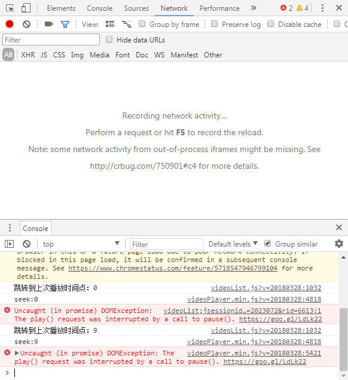

# 智慧树刷课与题集

[题库与答案](https://jokin1999.github.io/zhihuishu-web/)

**本项目开源免费，请勿用于任何商业用途，否则后果自负！**

## 技术支持 Support

在使用过程中有任何问题可以发送问题邮件至 **jokin@twocola.com** ，但是 **在此之前** ，请仔细阅读下方 **使用步骤** ！

## 特性 Features

- 自动播放下个视频
- 自动调整清晰度
- 自动静音
- 自动调整视频播放速度至1.5倍（经测试，1.5倍是极限可正常刷课速度）
- 自动 **关闭题目弹窗** （不会对成绩有影响）

## 风险与警告 Warning

- **【警告】** **章节测试不会自动完成**。
- **【警告】** 由于技术限制，刷课过程中，有 **极小概率** 出现未播放到末尾自动跳转下一集的情况，请获悉！
- **【警告】** 在运行过程中，片头5秒内可能出现 **未静音** 情况，请自行运行此页面下方的 **静音修复** 代码（运行方式参考使用步骤最后2步）。
- **【风险】** 代码运行后，全自动模拟正常网页操作流程，理论上无查封风险，但不排除风险，请获悉！
- **【提示】** 代码完全开源可查，可放心使用。
- **【提示】** 代码仅可用于 **智慧树**。
- **【提示】** 代码提交于 **2018-04-18**，亲测可用，不再提供后续更新支持（就算打脸也不通知）。

## 使用步骤

- 下载Chrome浏览器（如果有360、火狐等应该不用下载）
  - [官网（有时无法连接）](https://google.cn/chrome/browser/desktop/index.html)
  - [百度（推荐普通下载）](http://rj.baidu.com/soft/detail/14744.html?ald)
- 使用 **Chrome浏览器** 打开智慧树网课播放页
- 按下 Ctrl+Shift+I 打开开发者工具（F12应该也可以，如下图）
  - 
- 复制 **`zhihuishu.txt` 文件中的代码（推荐）** 或下方代码
- 在 **开发者工具** 中点击下方的 **Console** 选项卡
  - 
- 在最后一行 `>` 处粘贴代码
  - 
- 出现 `成功运行自动刷网课智慧树版` 字样即成功

**请务必将代码复制完整**

## 刷课代码

```
console.log("成功运行自动刷网课智慧树版");
var _it = null;
start();
closeQ();
function closeQuestion(){
  clearInterval(_it);
  var t = $(".popboxes_close.tmui_txt_hidd");
  if( t.length != 0 ){
    t.click();
  }
  if( $(".popboxes_close.tmui_txt_hidd").length != 0 ){
    closeQuestion();
  }else{
    start();
  }
}
function start(){
  _it = setInterval(function(){
    console.log("【提示】刷课程序运行中");
    // 关闭弹题
    closeQuestion()
    // 判断清晰度调整为高清
    if(!$(".line1bq").hasClass("active")){
      $(".line1bq").click();
      console.log("【提示】刷课程序已将清晰度调整为“标清”");
    }
    // 自动静音
    if(!$(".volumeBox").hasClass("volumeNone")){
      $(".volumeIcon").click();
      console.log("【提示】刷课程序已将视频静音");
    }
    // 1.5倍速
    $(".speedTab15").click();
    // 下一节课
    if($("div.bigPlayButton").attr("style") != "display: none;" && $(".popboxes_close.tmui_txt_hidd").length === 0 ){
      $("#nextBtn").click();
    }
  },5000);
}
function closeQ(){
  setInterval(function(){
    $(".popboxes_close.tmui_txt_hidd").click();
  },500);
}
```

## 静音修复代码

**使用此代码可能占用更多的系统资源（CPU）**

```
console.log("静音修复代码成功启动");
setInterval(function(){
  if(!$(".volumeBox").hasClass("volumeNone")){
    $(".volumeIcon").click();
  }
},100);
```

## 更新

- 修复`静音修复`代码出现鬼畜的情况
- 增加`弹题修复`
  - `弹题修复`代码主要针对极小概率的关闭弹题失败的问题

---

Powered by Jokin.

All rights reserved.
